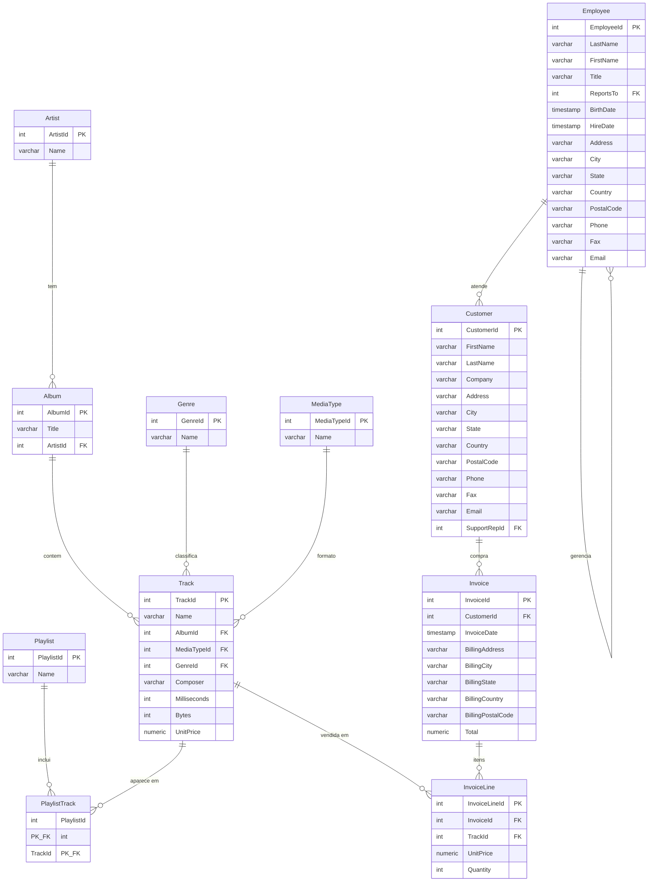

# Database Schema - Chinook (Music Store)

**Host:** Neon PostgreSQL (us-east-1)
**Database:** neondb
**Schema:** public
**Conexao:** variavel de ambiente `DATABASE_URL` no `.env`

> **IMPORTANTE:** Os nomes de tabelas e colunas usam PascalCase e devem ser referenciados com aspas duplas no SQL (ex: `public."Album"`).

## Tabelas e Contagem de Registros

| Tabela | Registros | Descricao |
|---|---|---|
| Artist | 275 | Catalogo de artistas/bandas. Tabela raiz do dominio musical. |
| Album | 347 | Albuns de musica, cada um pertencente a um artista. |
| Track | 3.503 | Faixas musicais individuais. Tabela central do modelo, conecta album, genero, tipo de midia e vendas. |
| Genre | 25 | Tabela de dominio com os generos musicais (Rock, Jazz, Latin, etc.). |
| MediaType | 5 | Tabela de dominio com os formatos de arquivo de audio (MPEG, AAC, etc.). |
| Playlist | 18 | Playlists curadas, cada uma agrupando varias faixas. |
| PlaylistTrack | 8.715 | Tabela associativa N:N entre Playlist e Track. |
| Employee | 8 | Funcionarios da loja. Possui hierarquia via auto-referencia (ReportsTo). Atuam como representantes de suporte para clientes. |
| Customer | 59 | Clientes da loja, com dados de contato e endereco. Cada cliente pode ter um funcionario de suporte vinculado. |
| Invoice | 412 | Faturas/pedidos de compra de clientes, com dados de cobranca e valor total. |
| InvoiceLine | 2.240 | Itens individuais de cada fatura. Cada linha representa a compra de uma faixa especifica. |

## Diagrama ERD

## Modelo de Dados Detalhado

### Artist
Catalogo de artistas e bandas. Ponto de partida para navegar o acervo musical.

| Coluna | Tipo | Nullable | Descricao |
|---|---|---|---|
| **ArtistId** (PK) | integer | NO | ID do artista |
| Name | varchar | YES | Nome do artista |

### Album
Albuns de musica. Cada album pertence a exatamente um artista e agrupa uma ou mais faixas.

| Coluna | Tipo | Nullable | Descricao |
|---|---|---|---|
| **AlbumId** (PK) | integer | NO | ID do album |
| Title | varchar | NO | Titulo do album |
| ArtistId (FK -> Artist) | integer | NO | Artista do album |

### Genre
Tabela de dominio com generos musicais (Rock, Jazz, Blues, Latin, etc.). Usada para classificar faixas.

| Coluna | Tipo | Nullable | Descricao |
|---|---|---|---|
| **GenreId** (PK) | integer | NO | ID do genero |
| Name | varchar | YES | Nome do genero musical |

### MediaType
Tabela de dominio com formatos de arquivo de audio (MPEG, AAC, WAV, etc.). Define o formato de distribuicao de cada faixa.

| Coluna | Tipo | Nullable | Descricao |
|---|---|---|---|
| **MediaTypeId** (PK) | integer | NO | ID do tipo de midia |
| Name | varchar | YES | Nome do tipo (ex: MPEG, AAC) |

### Track
Tabela central do modelo. Cada registro e uma faixa musical com dados de duracao, tamanho, preco e compositor. Conecta-se a Album, Genre, MediaType e e o item vendido nas faturas.

| Coluna | Tipo | Nullable | Descricao |
|---|---|---|---|
| **TrackId** (PK) | integer | NO | ID da faixa |
| Name | varchar | NO | Nome da faixa |
| AlbumId (FK -> Album) | integer | YES | Album da faixa |
| MediaTypeId (FK -> MediaType) | integer | NO | Tipo de midia |
| GenreId (FK -> Genre) | integer | YES | Genero musical |
| Composer | varchar | YES | Compositor |
| Milliseconds | integer | NO | Duracao em milissegundos |
| Bytes | integer | YES | Tamanho em bytes |
| UnitPrice | numeric | NO | Preco unitario |

### Playlist
Playlists curadas que agrupam faixas por tema ou selecao. Relaciona-se com Track via tabela associativa PlaylistTrack.

| Coluna | Tipo | Nullable | Descricao |
|---|---|---|---|
| **PlaylistId** (PK) | integer | NO | ID da playlist |
| Name | varchar | YES | Nome da playlist |

### PlaylistTrack (tabela associativa)
Resolve o relacionamento N:N entre Playlist e Track. PK composta por ambas as FKs.

| Coluna | Tipo | Nullable | Descricao |
|---|---|---|---|
| **PlaylistId** (PK, FK -> Playlist) | integer | NO | ID da playlist |
| **TrackId** (PK, FK -> Track) | integer | NO | ID da faixa |

### Employee
Funcionarios da loja de musica. Possui hierarquia organizacional via auto-referencia (ReportsTo). Alguns funcionarios atuam como representantes de suporte vinculados a clientes.

| Coluna | Tipo | Nullable | Descricao |
|---|---|---|---|
| **EmployeeId** (PK) | integer | NO | ID do funcionario |
| LastName | varchar | NO | Sobrenome |
| FirstName | varchar | NO | Nome |
| Title | varchar | YES | Cargo |
| ReportsTo (FK -> Employee) | integer | YES | Gerente (auto-referencia) |
| BirthDate | timestamp | YES | Data de nascimento |
| HireDate | timestamp | YES | Data de contratacao |
| Address | varchar | YES | Endereco |
| City | varchar | YES | Cidade |
| State | varchar | YES | Estado |
| Country | varchar | YES | Pais |
| PostalCode | varchar | YES | CEP |
| Phone | varchar | YES | Telefone |
| Fax | varchar | YES | Fax |
| Email | varchar | YES | Email |

### Customer
Clientes da loja digital. Armazena dados de contato, endereco e empresa. Cada cliente pode ter um funcionario de suporte (SupportRepId) designado.

| Coluna | Tipo | Nullable | Descricao |
|---|---|---|---|
| **CustomerId** (PK) | integer | NO | ID do cliente |
| FirstName | varchar | NO | Nome |
| LastName | varchar | NO | Sobrenome |
| Company | varchar | YES | Empresa |
| Address | varchar | YES | Endereco |
| City | varchar | YES | Cidade |
| State | varchar | YES | Estado |
| Country | varchar | YES | Pais |
| PostalCode | varchar | YES | CEP |
| Phone | varchar | YES | Telefone |
| Fax | varchar | YES | Fax |
| Email | varchar | NO | Email |
| SupportRepId (FK -> Employee) | integer | YES | Funcionario de suporte |

### Invoice
Faturas de compra. Cada fatura pertence a um cliente e contem dados de cobranca (endereco, cidade, pais) e o valor total. Os itens comprados ficam em InvoiceLine.

| Coluna | Tipo | Nullable | Descricao |
|---|---|---|---|
| **InvoiceId** (PK) | integer | NO | ID da fatura |
| CustomerId (FK -> Customer) | integer | NO | Cliente |
| InvoiceDate | timestamp | NO | Data da fatura |
| BillingAddress | varchar | YES | Endereco de cobranca |
| BillingCity | varchar | YES | Cidade de cobranca |
| BillingState | varchar | YES | Estado de cobranca |
| BillingCountry | varchar | YES | Pais de cobranca |
| BillingPostalCode | varchar | YES | CEP de cobranca |
| Total | numeric | NO | Valor total |

### InvoiceLine
Itens individuais de cada fatura. Cada linha representa a compra de uma faixa especifica com preco e quantidade. E o elo entre o dominio comercial (Invoice/Customer) e o dominio musical (Track).

| Coluna | Tipo | Nullable | Descricao |
|---|---|---|---|
| **InvoiceLineId** (PK) | integer | NO | ID da linha da fatura |
| InvoiceId (FK -> Invoice) | integer | NO | Fatura |
| TrackId (FK -> Track) | integer | NO | Faixa comprada |
| UnitPrice | numeric | NO | Preco unitario |
| Quantity | integer | NO | Quantidade |

## Indices

Todas as PKs possuem indice UNIQUE. Indices adicionais em FKs:

- `Album.ArtistId`
- `Customer.SupportRepId`
- `Employee.ReportsTo`
- `Invoice.CustomerId`
- `InvoiceLine.InvoiceId`
- `InvoiceLine.TrackId`
- `PlaylistTrack.TrackId`
- `Track.AlbumId`
- `Track.GenreId`
- `Track.MediaTypeId`
